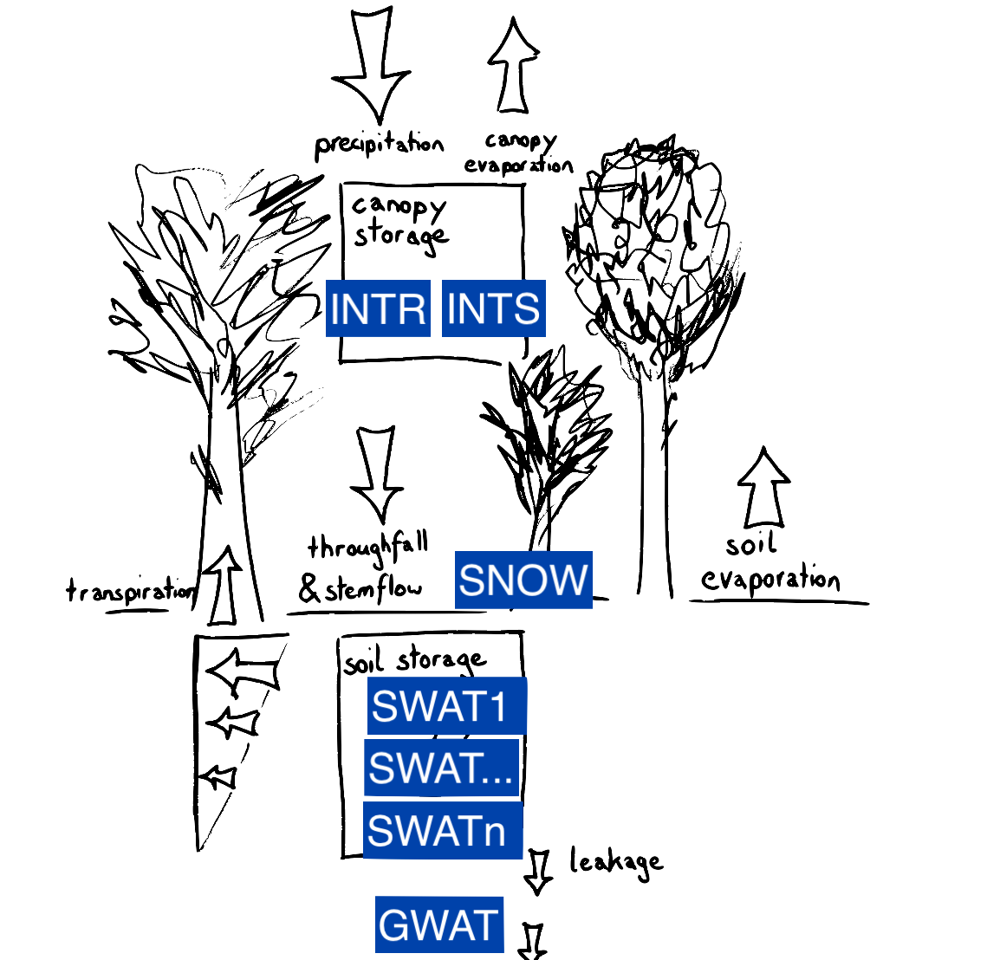

# SVAT Model

## Description
LWFBrook90Julia.jl is a 1D soil vegetation atmosphere transport model for forested areas.
It models the vertical soil water movement using the Richards equations as well as preferential flow.
It further includes processes such as soil and plant evapotranspiration as well as precipitation storage in the form of snowpack or interception by vegetation.

Processes and state variables in LWF-BROOK90 are summarised visually in Figure 1 below.
```@raw html
<p align="center">
<br>
<br><em><b>Figure 1</b>: Summary of processes and state variables used in LWFBrook90Julia</em><br>
<p>
```


## Implementation
- based on LWFBrook90R which is implemented in Fortran and has an R package as interface.
- based on BROOK90 www.ecoshift.net/brook/b90doc.html

LWFBrook90Julia.jl is 100% implemented in Julia. It defines the dynamical system in terms of ordinary differential equations and corresponding (time-varying) parameters and makes use of the package DifferentialEquations.jl for solving this dynamical system for a specified time `tspan` and intial conditions `u0`.

LWFBrook90Julia is developed with the following objectives in mind:
- [ ] efficient parameter estimation
- [ ] model flexibility allowing to reparametrize processes (possibly resulting in a [flexible model framework](https://presentations.copernicus.org/EGU2020/EGU2020-17975_presentation.pdf))
- [ ] support for stable isotopes (δ¹⁸O and δ²H) by including transport equation and fractionation processes

- LWFBrook90Julia can output additional quantities in daily, monthly or yearly resolution derived during simulation.
- For performance reasons computation of these additional quantities can also be deactivated during simulation. (The quantities can be computed post-simulation from the state vector (not yet implemented).)
